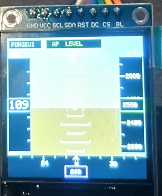

# ForgeUI MicroPilot — ESP32-S3 + ST7789 240×240

ForgeUI MicroPilot is a physically tested joystick-controlled miniature Primary Flight Display (PFD) / glass-cockpit graphics showcase. It runs on an ESP32-S3 DevKitC-1 with a 1.54-inch ST7789 square SPI TFT at its native 240×240 resolution, and is built on the proven ForgeUI ST7789 240×240 square-display baseline.



## PHYSICAL DISPLAY / MICROPILOT PASS

MicroPilot has been physically run on the stated ESP32-S3 and ST7789 hardware.

- Firmware build and flash: PASS
- ST7789 initialization and full 240×240 rendering: PASS
- Joystick calibration and control: PASS
- MicroPilot startup/self-test and PFD operation: PASS
- Artificial horizon, pitch ladder, flight tapes, heading, and AP LEVEL annunciation: PASS

## MicroPilot overview

MicroPilot renders an animated PFD with a simulated aircraft attitude and flight data. The joystick commands bank and pitch in manual flight; AP LEVEL smoothly commands the simulated aircraft back to wings-level, zero-pitch flight.

## Controls

| Joystick input | Action |
| --- | --- |
| Left / right | Command bank |
| Forward / back | Command pitch |
| Push switch | Toggle AP LEVEL |

With AP LEVEL enabled, the firmware smoothly returns commanded bank and pitch to zero.

## Artificial-horizon / PFD feature set

- ForgeUI MicroPilot startup/self-test
- 64-sample joystick-centre calibration with a 180-unit dead zone
- Smooth manual bank and pitch response
- Animated blue-sky and brown-ground artificial horizon responsive to bank and pitch
- Moving, rotating pitch ladder; fixed aircraft reference symbol; roll scale; and moving bank pointer
- IAS tape and current IAS box, altitude tape and current altitude box, and vertical-speed indicator
- Heading strip and current heading, with simulated heading response to bank
- Simulated vertical-speed response to pitch, altitude, and airspeed
- MANUAL FLT and AP LEVEL annunciations, plus excessive-bank and excessive-pitch warnings
- ForgeUI identity panel, full-resolution 240×240 `Arduino_Canvas` rendering, and an approximately 30 FPS target loop

## Autopilot behavior

The joystick push switch toggles AP LEVEL with button debounce. In AP LEVEL, the simulated aircraft smoothly commands wings-level and zero-pitch attitude. In manual flight, joystick X commands bank and joystick Y commands pitch.

## Physical joystick mapping

| Joystick | ESP32-S3 |
| --- | --- |
| SW | GPIO4 |
| VRy | GPIO5 |
| VRx | GPIO6 |
| +5V-labelled supply | 3.3V |
| GND | GND |

GPIO7 remains spare.

## Hardware

- Board: ESP32-S3 DevKitC-1
- Display: 1.54-inch square ST7789 SPI TFT
- Native resolution: 240×240
- PCB marking: `1.54TFT-SPI-ST7789 Ver:1.1`
- Input: analogue joystick with push switch

## Display + joystick wiring

| ST7789 | ESP32-S3 |
| --- | --- |
| GND | GND |
| VCC | 3.3V |
| SCL / SCLK | GPIO12 |
| SDA / MOSI | GPIO11 |
| RES / RST | GPIO10 |
| DC | GPIO9 |
| CS | GPIO8 |
| BLK | 3.3V |

MISO is unused. **BLK → 3.3V is physically proven for this tested square module only; do not automatically generalize that connection to other ST7789 modules.**

## Proven display configuration

The firmware uses Arduino_GFX with ESP32 HSPI, CS on GPIO8, and an ST7789 configured for a 240×240 viewport. It renders through a full-resolution `Arduino_Canvas` before flushing to the display.

## Software/build baseline

- PlatformIO
- `espressif32@6.7.0`
- `esp32-s3-devkitc-1`
- Arduino framework
- Arduino_GFX `1.3.7`

Arduino_GFX is deliberately pinned to 1.3.7 because a newer unpinned version produced an `esp32-hal-periman.h` compatibility failure in this environment. The physically tested build can emit internal `SPI_MAX_PIXELS_AT_ONCE` redefinition warnings from the pinned dependency and still succeeds.

## Build and flash

Use PlatformIO with the pinned project configuration:

```sh
pio run
pio run --target upload
pio device monitor
```

## Physical validation record

The current images are retained as physical evidence while improved final photographs are prepared.

| Image | Evidence |
| --- | --- |
| [Splash1.png](Splash1.png) | MicroPilot startup/calibration physical evidence |
| [Splash2.png](Splash2.png) | Primary current MicroPilot PFD evidence and temporary README hero |
| [Splash3.png](Splash3.png) | Additional MicroPilot PFD physical evidence |
| [splash-st7789-240x240-square.png](splash-st7789-240x240-square.png) | Underlying ST7789 square-display bring-up evidence only |

## Related golden square-display reference

[forgeui-hw-st7789-240x240-square](https://github.com/RTechAI/forgeui-hw-st7789-240x240-square) is the golden ForgeUI hardware reference for this physically proven square-display configuration. MicroPilot is an application/showcase built on that baseline.

## ForgeUI Hardware Lab

This project is part of the [ForgeUI](https://forgeui.co.nz) Hardware Lab. [ForgeUI Studio](https://studio.forgeui.co.nz) provides the broader ForgeUI interface-design context.

## External dependency and reference attribution

[Arduino_GFX](https://github.com/moononournation/Arduino_GFX) is an independently owned and licensed external dependency; it retains its own copyright and license.

The independent [kursatEcinni/esp32s3-st7789-test](https://github.com/kursatEcinni/esp32s3-st7789-test) repository was reference material during the initial ST7789 investigation. ForgeUI does not own that repository, and this project does not copy its branding or LVGL demo material.

## License and repository scope

This repository documents a physically tested MicroPilot implementation for the stated ESP32-S3 board, display module, wiring, and joystick mapping. Validate other modules, board revisions, and wiring independently.

ForgeUI-authored content is released under the [MIT License](LICENSE). Third-party software remains subject to its respective licenses.
