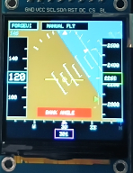

# ForgeUI MicroPilot — ESP32-S3 + ST7789 240×240

ForgeUI MicroPilot is an official ForgeUI Hardware Lab project developed by RTechAI. It is a physically tested joystick-controlled miniature Primary Flight Display (PFD) / glass-cockpit graphics showcase for an ESP32-S3 DevKitC-1, a 1.54-inch ST7789 240×240 TFT, and an analogue joystick. It belongs to the wider ForgeUI ESP32 hardware and project ecosystem.



## PHYSICAL DISPLAY / MICROPILOT PASS

MicroPilot has been physically run on the stated ESP32-S3 and ST7789 hardware.

- Firmware build and flash: PASS
- ST7789 initialization and full 240×240 rendering: PASS
- Joystick calibration and control: PASS
- MicroPilot startup/self-test and PFD operation: PASS
- Artificial horizon, pitch ladder, flight tapes, heading, and AP LEVEL annunciation: PASS

## MicroPilot overview

MicroPilot renders an animated PFD with a simulated aircraft attitude and flight data. The joystick commands bank and pitch in manual flight; AP LEVEL smoothly commands the simulated aircraft back to wings-level, zero-pitch flight. IAS, altitude, vertical speed, and heading are simulated demo flight-display values generated by MicroPilot; the project is not connected to aircraft sensors, avionics buses, certified avionics, or flight hardware.

## Controls

| Joystick input | Action |
| --- | --- |
| Left / right | Command bank |
| Forward / back | Command pitch |
| Push switch | Toggle AP LEVEL |

With AP LEVEL enabled, the firmware smoothly returns commanded bank and pitch to zero.

## Artificial-horizon / PFD feature set

- ForgeUI MicroPilot startup/self-test
- 64-sample joystick-centre calibration with a 180-unit dead zone
- Smooth manual bank and pitch response
- Animated blue-sky and brown-ground artificial horizon responsive to bank and pitch
- Moving, rotating pitch ladder; fixed aircraft reference symbol; roll scale; and moving bank pointer
- IAS tape and current IAS box, altitude tape and current altitude box, and vertical-speed indicator
- Heading strip and current heading, with simulated heading response to bank
- Simulated vertical-speed response to pitch, altitude, and airspeed
- MANUAL FLT and AP LEVEL annunciations, plus excessive-bank and excessive-pitch warnings
- ForgeUI identity panel, full-resolution 240×240 `Arduino_Canvas` rendering, and an approximately 30 FPS target loop

## Autopilot behavior

The joystick push switch toggles AP LEVEL with button debounce. In AP LEVEL, the simulated aircraft smoothly commands wings-level and zero-pitch attitude. In manual flight, joystick X commands bank and joystick Y commands pitch.

## Physical joystick mapping

| Joystick | ESP32-S3 |
| --- | --- |
| SW | GPIO4 |
| VRy | GPIO5 |
| VRx | GPIO6 |
| +5V-labelled supply | 3.3V |
| GND | GND |

GPIO7 remains spare.

## Hardware

- Board: ESP32-S3 DevKitC-1
- Display: 1.54-inch square ST7789 SPI TFT
- Native resolution: 240×240
- PCB marking: `1.54TFT-SPI-ST7789 Ver:1.1`
- Input: analogue joystick with push switch

## Display + joystick wiring

| ST7789 | ESP32-S3 |
| --- | --- |
| GND | GND |
| VCC | 3.3V |
| SCL / SCLK | GPIO12 |
| SDA / MOSI | GPIO11 |
| RES / RST | GPIO10 |
| DC | GPIO9 |
| CS | GPIO8 |
| BLK | 3.3V |

MISO is unused. **BLK → 3.3V is physically proven for this tested square module only; do not automatically generalize that connection to other ST7789 modules.**

## Proven display configuration

The firmware uses Arduino_GFX with ESP32 HSPI, CS on GPIO8, and an ST7789 configured for a 240×240 viewport. It renders through a full-resolution `Arduino_Canvas` before flushing to the display.

## Software/build baseline

- PlatformIO
- `espressif32@6.7.0`
- `esp32-s3-devkitc-1`
- Arduino framework
- Arduino_GFX `1.3.7`

Arduino_GFX is deliberately pinned to 1.3.7 because a newer unpinned version produced an `esp32-hal-periman.h` compatibility failure in this environment. The physically tested build can emit internal `SPI_MAX_PIXELS_AT_ONCE` redefinition warnings from the pinned dependency and still succeeds.

## Build and flash

Use PlatformIO with the pinned project configuration:

```sh
pio run
pio run --target upload
pio device monitor
```

## Physical validation record

The selected photographs provide physical evidence of the tested MicroPilot display module and its operating states.

| Image | Evidence |
| --- | --- |
| [splash1-st7789-240x240-square-micropilot.png](splash1-st7789-240x240-square-micropilot.png) | MicroPilot startup/self-test, including `SYSTEM SELF TEST` and `PFD READY` |
| [splash3-st7789-240x240-square-micropilot.png](splash3-st7789-240x240-square-micropilot.png) | Near-level `MANUAL FLT` PFD state with clear horizon, pitch ladder, tapes, and heading presentation |
| [splash4-st7789-240x240-square-micropilot.png](splash4-st7789-240x240-square-micropilot.png) | High-bank PFD state with visible horizon, roll scale/pointer, flight tapes, and warning annunciation |

## Related ForgeUI Projects

- [Golden ST7789 240×240 Square Display](https://github.com/RTechAI/forgeui-hw-st7789-240x240-square) — known-good ESP32-S3/ST7789 physical display baseline for this configuration.
- [ForgeUI MicroAsteroids](https://github.com/RTechAI/forgeui-hw-st7789-240x240-square-microasteroids) — joystick-controlled arcade and graphics showcase built on the square-display baseline.
- [ForgeUI MicroScope](https://github.com/RTechAI/forgeui-hw-st7789-240x240-square-microscope) — simulated instrumentation and graphics showcase for the square display.

## ForgeUI Hardware Lab

ForgeUI Hardware Lab is an RTechAI/ForgeUI collection of physically tested ESP32 boards, displays, peripherals, examples, and experimental projects. It preserves reproducible hardware baselines through hardware identification, minimal bring-up, physical proof, and known-good configurations, then evaluates demonstrations and candidate targets for future ForgeUI Studio workflows.

This Hardware Lab project does not by itself indicate that this ESP32-S3/ST7789 target is currently integrated into ForgeUI Studio.

## External dependency and reference attribution

[Arduino_GFX](https://github.com/moononournation/Arduino_GFX) is an independently owned and licensed external dependency; it retains its own copyright and license.

The independent [kursatEcinni/esp32s3-st7789-test](https://github.com/kursatEcinni/esp32s3-st7789-test) repository was reference material during the initial ST7789 investigation. ForgeUI does not own that repository, and this project does not copy its branding or LVGL demo material.

## License and repository scope

This repository documents a physically tested MicroPilot implementation for the stated ESP32-S3 board, display module, wiring, and joystick mapping. Validate other modules, board revisions, and wiring independently.

ForgeUI-authored content is released under the [MIT License](LICENSE). Third-party software remains subject to its respective licenses.

## About ForgeUI

ForgeUI is developed by RTechAI. Visit [RTechAI on GitHub](https://github.com/RTechAI) and [ForgeUI](https://forgeui.co.nz). [ForgeUI Studio](https://studio.forgeui.co.nz) is a visual embedded UI/HMI development environment for supported ESP32 hardware, while ForgeUI Hardware Lab provides physically tested hardware references and projects. Hardware Lab work preserves reproducible physical evidence and evaluates hardware and examples for ForgeUI workflows.

ForgeUI Hosted Studio is available for public registration.
